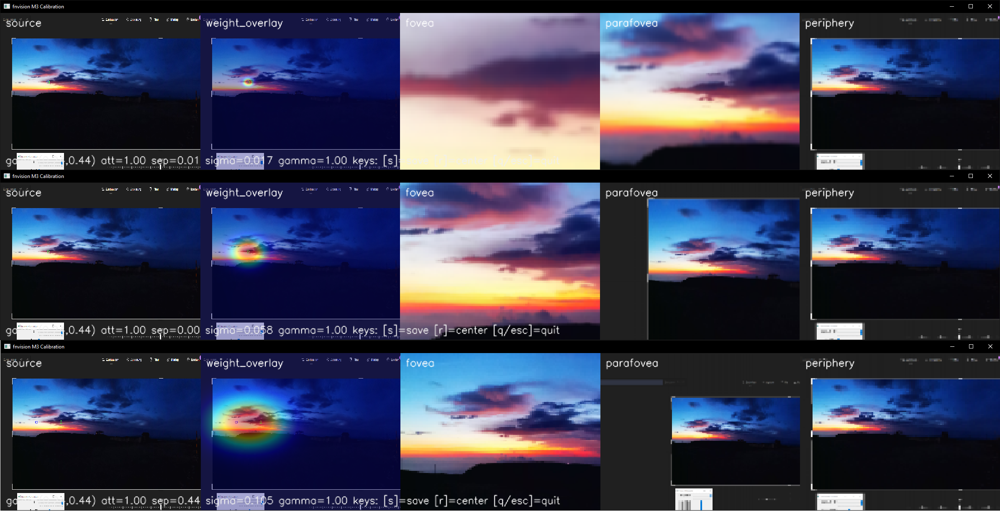
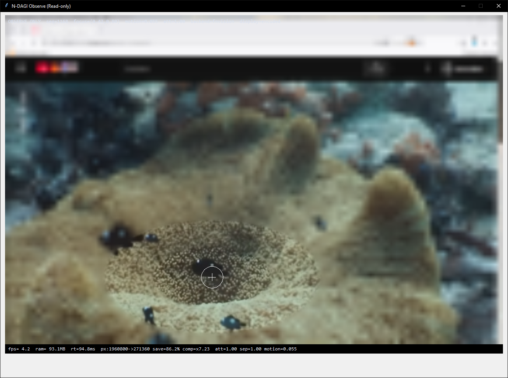
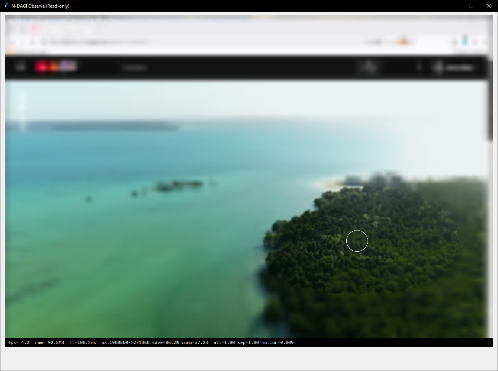
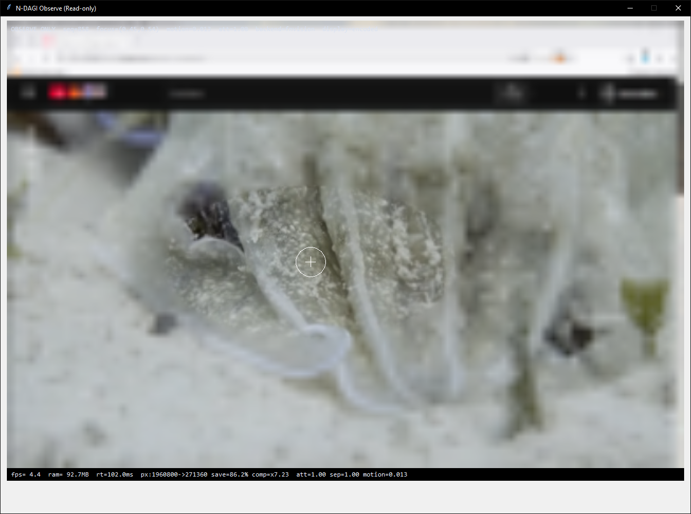

# fnvision - Fovea Native Vision

<!-- badges: activate after first GitHub release -->
<!--  -->
<!--  -->


A lightweight, biologically-motivated foveated vision encoder for autonomous agents,
robotics, and AI research.

**No heavy transformers. No log-polar distortion. No patch tricks.**

---

## The Idea

Human vision does not sample the world uniformly. The fovea sees in sharp detail; the
periphery sees motion. This resolution gradient is what makes biological vision so efficient.

fnvision models this directly, from first principles:

- Two coupled foveal centers (F1, F2) with Gaussian resolution fields
- Three zones: fovea, parafovea, periphery - driven by the combined weight field
- Zoom via convergence: the distance between F1 and F2 is the only zoom parameter
- Float32 output, no geometric distortion
- An interactive calibration tool to tune parameters while watching through the encoder's eyes

## Why Not Existing Approaches

| | fnvision | Log-Polar | Meta CVPR 2025 | ICLR 2025 ViT |
| --- | --- | --- | --- | --- |
| Architecture | Standalone encoder | Classical | Transformer | ViT |
| Distortion | None | High (geometric) | None | None |
| Binocular F-system | Yes | No | No | No |
| Zoom control | Single parameter | N/A | N/A | N/A |
| GPU required | No | No | Yes | Yes |
| Live calibration tool | Yes | No | No | No |

## Installation

Primary (GitHub):

```bash
pip install "git+https://github.com/soenning-ai/fnvision.git"
```

For the calibration tool:

```bash
pip install "fnvision[tools] @ git+https://github.com/soenning-ai/fnvision.git"
```

Optional (PyPI):

```bash
pip install fnvision
```

Optional calibration install from PyPI:

```bash
pip install fnvision[tools]
```

## Quick Start

### Stateless Encoding (MF1)

```python
import numpy as np
from fnvision import FoveaConfig, FoveaEncoder

frame = np.random.randint(0, 255, (480, 640, 3), dtype=np.uint8)
encoder = FoveaEncoder(FoveaConfig())

result = encoder.encode(
    frame_rgb=frame,
    gaze_xy=(0.5, 0.5),         # center of frame
    f_separation=1.0,           # max separation = wide-angle
    attention_level=1.0,        # full attention
)

print(result.fovea.shape)       # (96, 96, 3)  float32
print(result.periphery.shape)   # (96, 96, 3)  float32
print(result.weight_map.shape)  # (480, 640)   float32
```

### Stateful Gaze Dynamics (MF2)

```python
from fnvision import FoveaConfig, FoveaEncoder, GazeController

cfg = FoveaConfig()
encoder = FoveaEncoder(cfg)
gaze = GazeController(cfg, initial_gaze=(0.5, 0.5))

for frame in video_frames:
    state = gaze.step(target_xy=(0.7, 0.3), dt=1.0)
    sep_norm_01 = (
        state.f_separation_norm / cfg.f_separation_max_norm
        if cfg.f_separation_max_norm > 0
        else 0.0
    )
    result = encoder.encode(
        frame_rgb=frame,
        gaze_xy=state.gaze_xy,
        f_separation=sep_norm_01,
    )
    # result.fovea tracks the target with saccades, hold, and jitter
```

### Deterministic Replay

```python
import numpy as np
from fnvision import FoveaConfig, GazeController

gaze = GazeController(
    FoveaConfig(),
    rng=np.random.default_rng(42),   # fixed seed = reproducible
)
# snapshot mid-sequence, reset later for exact replay
state_copy, rng_state = gaze.snapshot()
```

### Calibration Tool (M3 Baseline)

```bash
fnvision-calibrate --source camera
```

Optional sources:

```bash
fnvision-calibrate --source file --path path\\to\\image.png_or_video.mp4
fnvision-calibrate --source screen --region 100,100,1280,720
```

Keys:

- `q` / `Esc`: quit
- `r`: reset gaze to center
- `s`: save current config YAML snapshot

### M3 Calibration Examples

Sample collages captured from the calibration tool:




## Observed Runtime (NN-Demo)

Representative live values from an NN-Demo run (observe-only, fnvision backend):

| Metric | Value |
| --- | --- |
| Source pixels | `1720 x 1140 = 1,968,000` |
| Encoded pixels | `640 x 424 = 271,360` |
| Pixel reduction | `86.2%` |
| Compression factor | `x7.25` |
| Frame reaction time (`rt`) | `~100-110 ms` |
| Encoder process RAM | `~90-95 MB` (typically low two-digit to low three-digit MB range) |

Notes:

- The reduction/compression values come directly from the live demo overlay:
  `px:1968000 -> 271360`, `save=86.2%`, `comp=x7.25`.
- Values vary with monitor scale, capture size, and host load.

### Demo Images (demo1-demo3)





## Ethics and Acceptable Use

fnvision is released under the Apache License 2.0, free to use, modify, and distribute.

However, this project also includes a clear statement of intent:

**fnvision was not built to harm or surveil people.**

The author explicitly opposes the use of this software in weapons systems,
surveillance of individuals or populations, suppression of human rights,
or applications designed to cause harm to human beings.

This is not a legal restriction. It is a moral and ethical position.
A full statement of values and unacceptable uses is available in
[ACCEPTABLE_USE_POLICY.md](ACCEPTABLE_USE_POLICY.md).
## Documentation
- [Technical Specification](docs/SPEC_fnvision_v1.md)
- [Changelog](CHANGELOG.md)
- [Contributing](CONTRIBUTING.md)
- [Code of Conduct](CODE_OF_CONDUCT.md)
- [Security Policy](SECURITY.md)
- [GitHub](https://github.com/soenning-ai/fnvision)

## License

Apache 2.0 - see [LICENSE](LICENSE).

